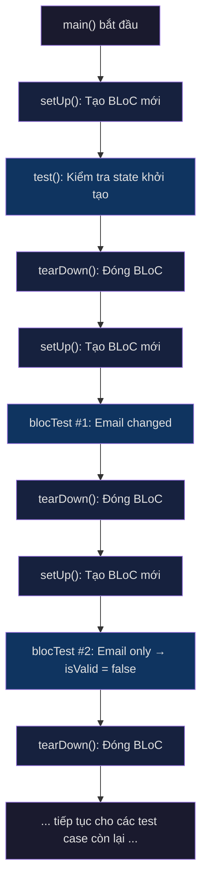

# 🧪 Hướng Dẫn Flutter Unit Test - Giải Thích Từng Dòng

## Mục lục
1. [Tổng Quan: Unit Test là gì?](#1-tổng-quan-unit-test-là-gì)
2. [Giải thích file `auth_login_form_bloc_test.dart`](#2-giải-thích-file-auth_login_form_bloc_testdart)
3. [Giải thích file `test_bundle.dart`](#3-giải-thích-file-test_bundledart)
4. [Giải thích file `repository_mocks.dart`](#4-giải-thích-file-repository_mocksdart)
5. [Test Results trong VS Code là gì?](#5-test-results-trong-vs-code-là-gì)
6. [Tóm tắt luồng chạy](#6-tóm-tắt-luồng-chạy)

---

## 1. Tổng Quan: Unit Test là gì?

> [!NOTE]
> **Unit Test** = Kiểm tra **một đơn vị nhỏ nhất** (1 hàm, 1 class, 1 BLoC) xem nó có chạy đúng không —
> **mà KHÔNG CẦN chạy app lên**, không cần mở điện thoại/emulator.

### Tại sao cần test?

```
Ví dụ thực tế:
- Bạn có BLoC xử lý form login.
- Bạn muốn chắc chắn rằng: khi user nhập email → state phải cập nhật email mới.
- Thay vì mở app, gõ email, rồi kiểm tra bằng mắt → bạn viết MỘT ĐOẠN CODE
  để tự động kiểm tra hộ bạn. Đó chính là Unit Test.
```

### Các package cần dùng

| Package | Mục đích |
|---------|----------|
| `flutter_test` | Package gốc của Flutter, cung cấp `test()`, `group()`, `expect()`, `setUp()`, `tearDown()` |
| `bloc_test` | Package hỗ trợ test BLoC, cung cấp `blocTest()` — không cần tự tay `add` event rồi `listen` state |
| `mocktail` | Package tạo "đồ giả" (mock) thay thế dependency thật (VD: giả lập Repository, API) |

---

## 2. Giải thích file [auth_login_form_bloc_test.dart](file:///Users/chunhuwq/Work/Flutter/flutter_core/test/features/auth/presentation/bloc/auth_login_form/auth_login_form_bloc_test.dart)

File này test BLoC [AuthLoginFormBloc](file:///Users/chunhuwq/Work/Flutter/flutter_core/lib/features/auth/presentation/bloc/auth_login_form/auth_login_form_bloc.dart). Dưới đây là giải thích **TỪNG DÒNG**:

---

### 📦 Phần Import (dòng 1-4)

```dart
import 'package:bloc_test/bloc_test.dart';       // ← Cung cấp hàm blocTest()
import 'package:flutter_test/flutter_test.dart';  // ← Cung cấp test(), group(), expect(), setUp(), tearDown()

import 'package:flutter_core/features/auth/presentation/bloc/auth_login_form/auth_login_form_bloc.dart';
// ↑ Import file BLoC thật mà ta sắp test. File này cũng kéo theo Event + State vì dùng `part`.
```

> [!IMPORTANT]
> - `bloc_test` = package chuyên dụng để test BLoC
> - `flutter_test` = package test gốc của Flutter, cung cấp mọi thứ cơ bản
> - Bạn import BLoC thật vì bạn đang **test** chính nó

---

### 🚀 Hàm [main()](file:///Users/chunhuwq/Work/Flutter/flutter_core/test/features/auth/presentation/bloc/auth_login_form/auth_login_form_bloc_test.dart#6-130) — Điểm bắt đầu (dòng 6)

```dart
void main() {
```

> **Dart test runner** sẽ tìm và chạy hàm [main()](file:///Users/chunhuwq/Work/Flutter/flutter_core/test/features/auth/presentation/bloc/auth_login_form/auth_login_form_bloc_test.dart#6-130) trong mỗi file [_test.dart](file:///Users/chunhuwq/Work/Flutter/flutter_core/test/features/auth/presentation/bloc/auth_login_form/auth_login_form_bloc_test.dart).
> Mọi `test()`, `group()`, `blocTest()` phải nằm **bên trong** [main()](file:///Users/chunhuwq/Work/Flutter/flutter_core/test/features/auth/presentation/bloc/auth_login_form/auth_login_form_bloc_test.dart#6-130).
>
> Khi bạn chạy lệnh `flutter test` hoặc nhấn nút ▶ trong VS Code →
> Dart sẽ gọi [main()](file:///Users/chunhuwq/Work/Flutter/flutter_core/test/features/auth/presentation/bloc/auth_login_form/auth_login_form_bloc_test.dart#6-130) → sau đó **lần lượt** chạy từng `test()` / `blocTest()` bên trong.

---

### 📌 Khai báo biến (dòng 7-11)

```dart
  late AuthLoginFormBloc authLoginFormBloc;
  // ↑ `late` = "Tao sẽ gán giá trị SAU, không phải ngay bây giờ"
  // Biến này chứa BLoC instance mà ta sẽ test

  const tEmail = 'test@gmail.com';
  // ↑ `t` prefix = "test data". Dữ liệu giả dùng chung cho mọi test case.
  //   Dùng `const` vì giá trị không bao giờ thay đổi.

  const tPassword = 'password123';
  // ↑ Tương tự, password giả
```

> [!TIP]
> Quy ước đặt tên: prefix `t` = "test". Giúp phân biệt dữ liệu giả với dữ liệu thật.
> VD: `tEmail`, `tPassword`, `tUser`, `tResponse`...

---

### ⚙️ `setUp()` — Chạy TRƯỚC mỗi test case (dòng 13-16)

```dart
  setUp(() {
    authLoginFormBloc = AuthLoginFormBloc();
  });
```

**Cơ chế hoạt động:**

```
Test Case 1 bắt đầu:
  → setUp() chạy → tạo BLoC MỚI
  → Test Case 1 chạy
  → tearDown() chạy → đóng BLoC

Test Case 2 bắt đầu:
  → setUp() chạy → tạo BLoC MỚI (hoàn toàn mới, sạch sẽ)
  → Test Case 2 chạy
  → tearDown() chạy → đóng BLoC

... cứ lặp lại cho mỗi test case
```

> [!IMPORTANT]
> **Tại sao phải tạo BLoC mới mỗi lần?**
> Vì mỗi test case phải **độc lập**. Nếu Test 1 thay đổi email, Test 2 không nên bị ảnh hưởng.
> Tạo lại BLoC mới = đảm bảo state luôn bắt đầu từ [LoginFormInitialState](file:///Users/chunhuwq/Work/Flutter/flutter_core/lib/features/auth/presentation/bloc/auth_login_form/auth_login_form_state.dart#20-28).

---

### 🧹 `tearDown()` — Chạy SAU mỗi test case (dòng 18-21)

```dart
  tearDown(() {
    authLoginFormBloc.close();
  });
```

> Đóng BLoC sau mỗi test → giải phóng bộ nhớ, đóng StreamController bên trong BLoC.
> Nếu không close → có thể bị memory leak trong quá trình test.

---

### ✅ Hàm `test()` — Test case đơn giản (dòng 26-34)

```dart
  test(
    'State khởi tạo phải là LoginFormInitialState với email/password rỗng và isValid = false',
    //  ↑ Tên test case (mô tả test này kiểm tra cái gì). Hiển thị trong Test Results.
    () {
      // ↑ Body: code kiểm tra thật sự
      expect(authLoginFormBloc.state, isA<LoginFormInitialState>());
      //     ↑ actual value            ↑ matcher: kiểm tra type có đúng không
      //
      // Dịch: "Tao mong đợi (expect) rằng state hiện tại CỦA bloc
      //        phải LÀ MỘT instance của LoginFormInitialState"

      expect(authLoginFormBloc.state.email, '');
      // Dịch: "email phải là chuỗi rỗng"

      expect(authLoginFormBloc.state.password, '');
      // Dịch: "password phải là chuỗi rỗng"

      expect(authLoginFormBloc.state.isValid, false);
      // Dịch: "isValid phải là false"
    },
  );
```

#### Giải thích `expect()`:

```
expect(actual, matcher)
        ↑ giá trị thật     ↑ giá trị mong đợi

Nếu actual == matcher  →  ✅ PASS (xanh)
Nếu actual != matcher  →  ❌ FAIL (đỏ) → báo lỗi chi tiết
```

#### Giải thích `isA<Type>()`:

```dart
isA<LoginFormInitialState>()
// = "Tao mong đợi nó là kiểu LoginFormInitialState"
// Tương đương: actual is LoginFormInitialState == true
```

#### Tại sao test này KHÔNG dùng `blocTest()`?

Vì ở đây **không có Event nào** được bắn. Ta chỉ kiểm tra state ban đầu ngay sau khi BLoC được tạo.
`blocTest()` dùng khi cần bắn Event và kiểm tra danh sách State emit ra.

---

### 📂 Hàm `group()` — Nhóm các test case liên quan (dòng 39)

```dart
  group('AuthLoginFormBloc - LoginFormEmailChangedEvent', () {
    // ... các blocTest bên trong ...
  });
```

**`group()` là gì?**

```
group() = "thư mục" chứa các test case liên quan.
Nó KHÔNG chạy gì cả, chỉ nhóm lại cho dễ đọc.

Trong Test Results, nó sẽ hiển thị kiểu:

📂 AuthLoginFormBloc - LoginFormEmailChangedEvent
   ✅ Nên emit LoginFormDataState với email mới khi email thay đổi
   ✅ Nên emit LoginFormDataState với isValid = false khi chỉ có email

📂 AuthLoginFormBloc - LoginFormPasswordChangedEvent
   ✅ Nên emit LoginFormDataState với password mới khi password thay đổi
   ...
```

> [!NOTE]
> `group()` có thể lồng nhau (group trong group).
> Bạn cũng có thể đặt `setUp()` / `tearDown()` bên trong `group()` — nó sẽ chỉ áp dụng cho các test trong group đó.

---

### 🧪 Hàm `blocTest()` — Test BLoC chuyên dụng (dòng 40-50)

Đây là **phần quan trọng nhất**. Hãy xem kỹ:

```dart
    blocTest<AuthLoginFormBloc, LoginFormState>(
    //       ↑ Type của BLoC       ↑ Type của State
    //  Generic types giúp blocTest biết nó đang test loại BLoC nào
    //  và State nào để so sánh

      'Nên emit LoginFormDataState với email mới khi email thay đổi',
      // ↑ Tên mô tả (hiển thị trong Test Results)

      build: () => authLoginFormBloc,
      // ↑ BUILD: Trả về BLoC instance cần test.
      //   Hàm này chạy ĐẦU TIÊN, tạo ra BLoC để blocTest sử dụng.
      //   Ở đây ta dùng lại biến đã tạo trong setUp().

      act: (bloc) => bloc.add(LoginFormEmailChangedEvent(tEmail)),
      // ↑ ACT: "Hành động" — bắn Event vào BLoC.
      //   Tham số `bloc` chính là BLoC từ build() ở trên.
      //   bloc.add(...) = gửi Event vào BLoC (giống user nhập email trên UI)

      expect: () => [
      // ↑ EXPECT: Danh sách State mà BLoC PHẢI emit ra SAU KHI act() chạy xong.
      //   Đây là một List<LoginFormState>.
      //   blocTest sẽ SO SÁNH danh sách state thật vs danh sách này.

        isA<LoginFormDataState>()
        // ↑ Kiểm tra state đầu tiên: phải là kiểu LoginFormDataState

            .having((s) => s.email, 'email', tEmail)
            // ↑ .having() = "kiểm tra thêm thuộc tính cụ thể"
            //   Tham số 1: (s) => s.email  → lấy thuộc tính email từ state
            //   Tham số 2: 'email'         → tên hiển thị khi bị lỗi (debug)
            //   Tham số 3: tEmail          → giá trị mong đợi: 'test@gmail.com'

            .having((s) => s.password, 'password', '')
            // ↑ password vẫn phải rỗng (vì ta chỉ thay đổi email, chưa nhập password)

            .having((s) => s.isValid, 'isValid', false),
            // ↑ isValid phải false (vì password rỗng → chưa đủ điều kiện)
      ],
    );
```

#### 🔄 Luồng chạy bên trong `blocTest()`:

```
Bước 1: build()  → Tạo/lấy BLoC instance
Bước 2: act()    → Bắn Event vào BLoC
Bước 3: BLoC xử lý Event → emit ra State mới
Bước 4: expect() → So sánh danh sách State emit ra vs danh sách mong đợi

Nếu khớp   → ✅ PASS
Nếu không  → ❌ FAIL + in ra chi tiết sai ở đâu
```

#### Tại sao `expect` là một **List** `[]`?

Vì mỗi Event có thể khiến BLoC emit **NHIỀU State**. `blocTest` thu thập **TẤT CẢ** state được emit, rồi so sánh toàn bộ list.

---

### 🧪 blocTest với NHIỀU Event liên tiếp (dòng 92-111)

```dart
    blocTest<AuthLoginFormBloc, LoginFormState>(
      'Nên emit isValid = true khi cả email và password đều không rỗng',
      build: () => authLoginFormBloc,

      act: (bloc) {
        // ↑ Chú ý: dùng {} thay vì => vì có NHIỀU dòng
        bloc.add(LoginFormEmailChangedEvent(tEmail));      // Event 1: nhập email
        bloc.add(LoginFormPasswordChangedEvent(tPassword)); // Event 2: nhập password
      },
      // ↑ Bắn 2 event liên tiếp, giống user nhập email rồi nhập password

      expect: () => [
        // State 1: Sau khi nhập email (password vẫn rỗng → isValid = false)
        isA<LoginFormDataState>()
            .having((s) => s.email, 'email', tEmail)
            .having((s) => s.isValid, 'isValid', false),

        // State 2: Sau khi nhập password (cả 2 đều có → isValid = true)  
        isA<LoginFormDataState>()
            .having((s) => s.email, 'email', tEmail)
            .having((s) => s.password, 'password', tPassword)
            .having((s) => s.isValid, 'isValid', true),
      ],
      // ↑ 2 Event → 2 State emit ra → expect phải có ĐÚNG 2 phần tử
    );
```

**Luồng chi tiết:**

```
act() chạy:
  1. bloc.add(LoginFormEmailChangedEvent('test@gmail.com'))
     → BLoC xử lý → emit LoginFormDataState(email: 'test@gmail.com', password: '', isValid: false)
  
  2. bloc.add(LoginFormPasswordChangedEvent('password123'))
     → BLoC xử lý → emit LoginFormDataState(email: 'test@gmail.com', password: 'password123', isValid: true)

blocTest thu thập: [State1, State2]
expect khai báo:   [State1, State2]
So sánh: khớp! → ✅ PASS
```

---

### 🧪 blocTest với 3 Event — Xóa rồi kiểm tra lại (dòng 113-127)

```dart
    blocTest<AuthLoginFormBloc, LoginFormState>(
      'Nên emit isValid = false khi email bị xoá sau khi đã nhập đủ',
      build: () => authLoginFormBloc,
      act: (bloc) {
        bloc.add(LoginFormEmailChangedEvent(tEmail));       // 1. Nhập email
        bloc.add(LoginFormPasswordChangedEvent(tPassword)); // 2. Nhập password
        bloc.add(const LoginFormEmailChangedEvent(''));      // 3. XÓA email (gửi chuỗi rỗng)
      },
      expect: () => [
        // State 1: có email, chưa có password → false
        isA<LoginFormDataState>().having((s) => s.isValid, 'isValid', false),
        // State 2: có cả hai → true
        isA<LoginFormDataState>().having((s) => s.isValid, 'isValid', true),
        // State 3: email bị xóa → false lại
        isA<LoginFormDataState>().having((s) => s.isValid, 'isValid', false),
      ],
    );
```

> [!TIP]
> Test case này kiểm tra **edge case**: user nhập xong rồi xóa.
> BLoC phải phản ứng đúng: `false → true → false`.

---

## 3. Giải thích file [test_bundle.dart](file:///Users/chunhuwq/Work/Flutter/flutter_core/test/test_bundle.dart)

```dart
import 'package:flutter_core/features/auth/domain/usecases/usecase_params.dart';
import 'package:flutter_test/flutter_test.dart';
import 'package:mocktail/mocktail.dart';

void setupTestBundle() {
  // ↑ Hàm tiện ích, gọi 1 lần trước khi chạy các test cần mock

  setUpAll(() {
  // ↑ setUpAll = chạy MỘT LẦN DUY NHẤT trước TẤT CẢ các test case
  //   (khác với setUp chạy trước TỪNG test case)

    registerFallbackValue(LoginParams(email: '', password: ''));
    // ↑ ĐÂY LÀ DÒNG QUAN TRỌNG NHẤT CỦA FILE NÀY
  });
}
```

### `registerFallbackValue()` là gì?

```
Khi bạn dùng mocktail để mock một hàm có tham số custom type, VD:

  when(() => mockRepo.login(any())).thenAnswer(...)
                                ↑
                          `any()` = "bất kỳ giá trị nào"

Nhưng `any()` cần biết KIỂU dữ liệu mặc định để hoạt động.
→ registerFallbackValue() = "Đăng ký một giá trị mặc định cho kiểu này"

VD: registerFallbackValue(LoginParams(email: '', password: ''))
    = "Nếu ai dùng any() cho kiểu LoginParams, dùng LoginParams rỗng làm mặc định"
```

> [!WARNING]
> Nếu bạn dùng `any()` cho custom class mà **KHÔNG** `registerFallbackValue()` →
> Test sẽ **CRASH** với lỗi: `"MissingStubError"` hoặc `"No fallback value registered"`.

### Khi nào cần file này?

Chỉ cần khi bạn test **UseCase** hoặc **Repository** mà dùng `when(() => mock.method(any()))`.
File [auth_login_form_bloc_test.dart](file:///Users/chunhuwq/Work/Flutter/flutter_core/test/features/auth/presentation/bloc/auth_login_form/auth_login_form_bloc_test.dart) hiện tại **KHÔNG dùng** file này vì BLoC đó không gọi UseCase/Repository.

---

## 4. Giải thích file [repository_mocks.dart](file:///Users/chunhuwq/Work/Flutter/flutter_core/test/mocks/repository_mocks.dart)

```dart
import 'package:mocktail/mocktail.dart';
import 'package:flutter_core/features/auth/domain/repositories/auth_repository.dart';

class MockAuthRepository extends Mock implements AuthRepository {}
//    ↑ Tên class mock    ↑ Kế thừa Mock    ↑ "Giả vờ" là AuthRepository
```

### Mock là gì?

```
                    APP THẬT                           UNIT TEST
               ┌─────────────┐                   ┌─────────────┐
               │    BLoC     │                    │    BLoC     │
               │             │                    │             │
               │  gọi xuống  │                    │  gọi xuống  │
               │      ↓      │                    │      ↓      │
               │ AuthRepo    │                    │ MockAuthRepo│ ← ĐỒ GIẢ
               │      ↓      │                    │  (trả data  │
               │   API thật  │                    │   giả lập)  │
               │      ↓      │                    └─────────────┘
               │  Server     │
               └─────────────┘

App thật:  BLoC → Repository → API → Server (cần internet, server chạy)
Unit test: BLoC → MockRepository → trả ngay data giả (không cần internet)
```

### Tại sao cần Mock?

| Không dùng Mock | Dùng Mock |
|----------------|-----------|
| Phải có server chạy | Không cần server |
| Phải có internet | Không cần internet |
| Test chậm (chờ API) | Test cực nhanh (< 1 giây) |
| Test không ổn định (server lỗi → test fail) | Test luôn ổn định |
| Khó test edge case (lỗi 500, timeout) | Dễ giả lập mọi tình huống |

### `extends Mock implements AuthRepository` nghĩa là gì?

```dart
// AuthRepository thật (interface/abstract class):
abstract class AuthRepository {
  Future<Either<Failure, UserEntity>> login(LoginParams params);
  Future<Either<Failure, UserEntity>> register(RegisterParams params);
}

// MockAuthRepository:
class MockAuthRepository extends Mock implements AuthRepository {}
// ↑ "Tao là một Mock, và tao giả vờ là AuthRepository"
// ↑ Mọi method (login, register) sẽ được mocktail tự tạo ra.
// ↑ Bạn KHÔNG cần viết body cho bất kỳ method nào.
```

### Cách sử dụng Mock trong test:

```dart
// Trong test file:
final mockRepo = MockAuthRepository();

// "Setup": Khi ai gọi login() với BẤT KỲ tham số nào → trả về thành công
when(() => mockRepo.login(any()))
    .thenAnswer((_) async => Right(tUser));

// Giờ khi BLoC gọi mockRepo.login() → nó sẽ nhận được Right(tUser)
// mà KHÔNG gọi API thật!
```

---

## 5. Test Results trong VS Code là gì?

Nhìn vào hình bạn chụp, đây là tab **Test Results** trong VS Code:

```
┌─────────────────────────────────────────────────────────────────────┐
│  Tab "Test Results" trong VS Code                                   │
│                                                                     │
│  Bên trái (Console Log):                                           │
│  ┌─────────────────────────────────────────────────────┐            │
│  │ 🟡 ===== CLOSE AuthLoginFormBloc =====               │            │
│  │ 🟡 ===== CLOSE AuthLoginFormBloc =====               │            │
│  └─────────────────────────────────────────────────────┘            │
│  ↑ Đây là log từ hàm close() trong BLoC:                           │
│    @override                                                        │
│    Future<void> close() {                                           │
│      logger.i("===== CLOSE AuthLoginFormBloc =====");               │
│      return super.close();                                          │
│    }                                                                │
│  → tearDown() gọi bloc.close() → log này xuất hiện                 │
│  → Có 2 dòng = 2 test case vừa chạy (mỗi cái close 1 lần)        │
│                                                                     │
│  Bên phải (Test Tree - cây kết quả):                               │
│  ┌─────────────────────────────────────────────────────┐            │
│  │ Dart                                                  │           │
│  │  ✅ Nên emit LoginFormDataState với email mới khi ... │           │
│  │                                                       │           │
│  │ ▼ 2 older results                                     │           │
│  │  ▼ Test run at 4/21/2026, 6:41:56 PM                  │           │
│  │    ✅ State khởi tạo phải là LoginFormInitialState...  │           │
│  │    ✅ Nên emit LoginFormDataState với email mới...     │           │
│  │    ✅ Nên emit LoginFormDataState với isValid = false..│           │
│  │    ✅ Nên emit LoginFormDataState với password mới...  │           │
│  │    ✅ Nên emit LoginFormDataState với isValid = false..│           │
│  │    ✅ Nên emit isValid = true khi cả email và pass... │           │
│  │    ✅ Nên emit isValid = false khi email bị xoá...    │           │
│  └─────────────────────────────────────────────────────┘            │
└─────────────────────────────────────────────────────────────────────┘
```

### Giải thích chi tiết:

| Thành phần | Ý nghĩa |
|------------|---------|
| ✅ (dấu tích xanh) | Test case **PASS** — kết quả đúng như mong đợi |
| ❌ (dấu X đỏ) | Test case **FAIL** — kết quả sai, cần xem lỗi |
| Tên test case | Chính là chuỗi string bạn viết trong `test('...')` hoặc `blocTest('...')` |
| "2 older results" | Lịch sử các lần chạy test trước đó |
| "Test run at 6:41:56 PM" | Thời điểm bạn chạy test |
| 🟡 CLOSE log | Log in ra từ `tearDown()` → chứng minh BLoC đã được đóng đúng |

### Cách chạy test:

```bash
# Cách 1: Chạy TẤT CẢ test trong project
flutter test

# Cách 2: Chạy MỘT file test cụ thể
flutter test test/features/auth/presentation/bloc/auth_login_form/auth_login_form_bloc_test.dart

# Cách 3: Trong VS Code → nhấn nút ▶ cạnh test() hoặc group()

# Cách 4: Trong VS Code → mở Command Palette → "Dart: Run All Tests"
```

---

## 6. Tóm tắt luồng chạy

### Thứ tự chạy toàn bộ file test:



### So sánh các hàm chính:

| Hàm | Mục đích | Khi nào dùng |
|-----|----------|-------------|
| `test()` | Test đơn giản, kiểm tra 1 điều kiện | Kiểm tra state ban đầu, kiểm tra giá trị tĩnh |
| `group()` | Nhóm test case liên quan | Gom các test cùng 1 feature/event lại |
| `blocTest()` | Test BLoC: bắn Event → kiểm tra State | Mọi khi test BLoC có Event → State |
| `setUp()` | Chạy TRƯỚC **mỗi** test case | Tạo instance mới, reset trạng thái |
| `tearDown()` | Chạy SAU **mỗi** test case | Đóng/giải phóng tài nguyên |
| `setUpAll()` | Chạy **1 lần** trước tất cả test | Đăng ký fallback value, setup chung |
| `expect()` | So sánh actual vs expected | Trong test(), kiểm tra giá trị |
| `isA<T>()` | Kiểm tra kiểu dữ liệu | Khi cần check type, không check giá trị |
| `.having()` | Kiểm tra thuộc tính cụ thể | Dùng sau `isA<T>()` để check từng field |

### Mối quan hệ giữa 3 file:

```
┌─────────────────────────────────┐
│  repository_mocks.dart          │ ← Tạo "đồ giả" (MockAuthRepository)
│  (dùng khi test UseCase/BLoC   │    cho các test cần dependency
│   có dependency repository)     │
└──────────┬──────────────────────┘
           │ import
           ▼
┌─────────────────────────────────┐
│  test_bundle.dart               │ ← Đăng ký fallback values cho
│  (setup chung cho mọi test      │    custom types (LoginParams...)
│   dùng mocktail + any())        │    Gọi 1 lần là xong
└──────────┬──────────────────────┘
           │ gọi setupTestBundle()
           ▼
┌─────────────────────────────────┐
│  auth_login_form_bloc_test.dart │ ← File test chính
│  (test file hiện tại KHÔNG     │    Hiện tại BLoC này không cần Mock
│   import 2 file trên vì BLoC   │    vì không gọi Repository/UseCase
│   này không có dependency)      │
└─────────────────────────────────┘
```

> [!NOTE]
> File [auth_login_form_bloc_test.dart](file:///Users/chunhuwq/Work/Flutter/flutter_core/test/features/auth/presentation/bloc/auth_login_form/auth_login_form_bloc_test.dart) hiện tại **KHÔNG import** [test_bundle.dart](file:///Users/chunhuwq/Work/Flutter/flutter_core/test/test_bundle.dart) hay [repository_mocks.dart](file:///Users/chunhuwq/Work/Flutter/flutter_core/test/mocks/repository_mocks.dart).
> Vì [AuthLoginFormBloc](file:///Users/chunhuwq/Work/Flutter/flutter_core/lib/features/auth/presentation/bloc/auth_login_form/auth_login_form_bloc.dart#9-56) chỉ xử lý form validation thuần túy, không gọi API hay Repository.
>
> Nhưng khi bạn test **AuthBloc** (BLoC xử lý login thật, gọi `LoginUseCase`) →
> bạn SẼ CẦN cả 2 file đó để mock Repository và đăng ký fallback values.
